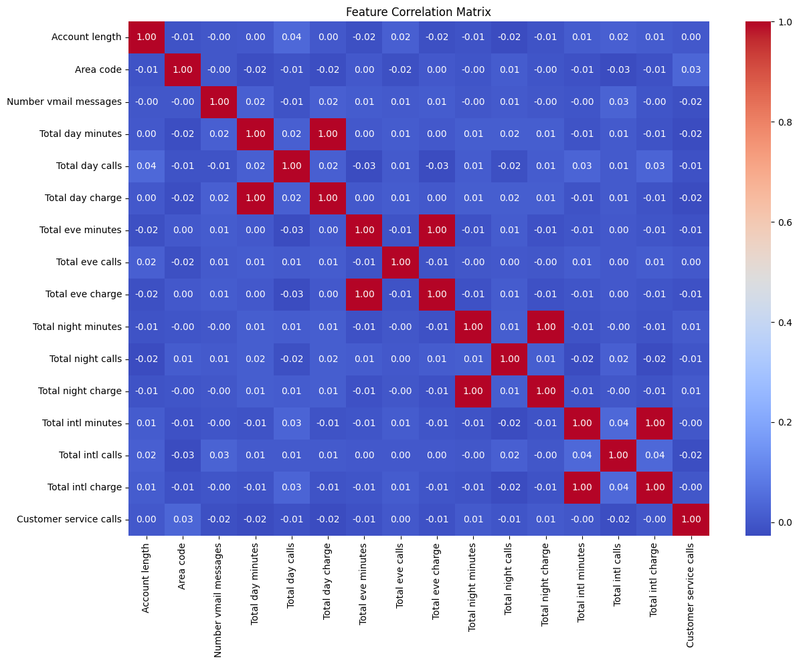
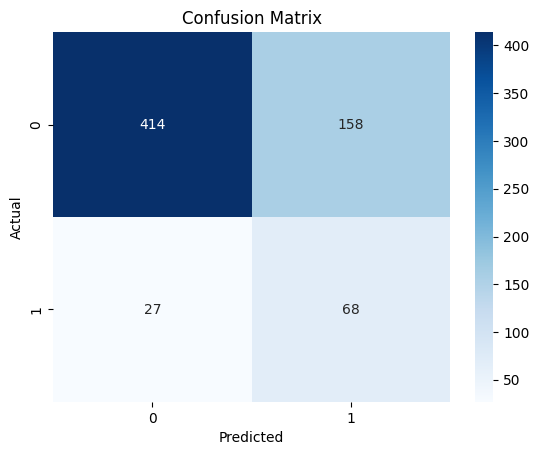
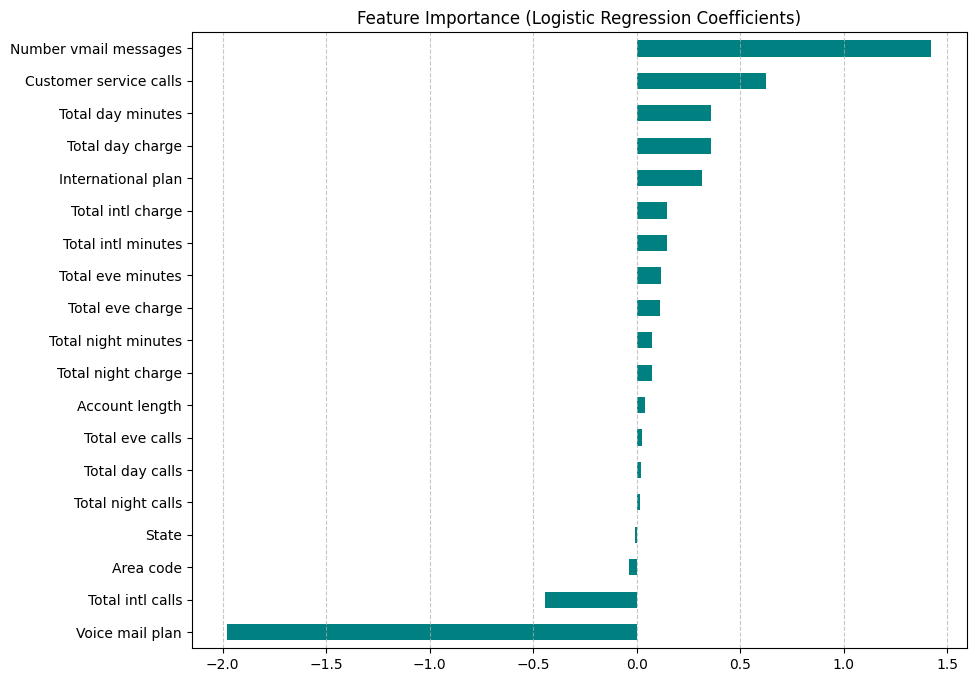

# Predictive Analytics for Customer Attrition (Churn)
**Independent Machine Learning Project | Binary Classification & Statistical Analysis**

## 1. Project Overview
This project identifies key predictors of customer churn within the telecommunications industry. Using the **BigML dataset (hosted on Kaggle)**, I developed a machine learning pipeline to distinguish between loyal customers and those likely to cancel their services.

## 2. Technical Methodology
* **Data Source:** [BigML Dataset via Kaggle](https://www.kaggle.com/datasets/becksf/telecom-churn-bigml-20)
* **Handling Class Imbalance (SMOTE):** Since the 'Churn' class represented only ~15% of the data, I implemented **SMOTE** to prevent model bias.
* **Statistical Validation:** Employed **5-Fold Cross-Validation**, achieving a mean CV accuracy of **86%**.

## 3. Visual Analysis & Results

### Feature Correlation
I analyzed 15+ metrics to identify which usage patterns (minutes, charges, service calls) co-vary with customer status.

### Model Evaluation (Confusion Matrix)
The model was optimized for **Recall**, ensuring we capture the maximum number of actual churners to allow for intervention.

### Key Drivers of Churn (Feature Importance)
The coefficients reveal that **Customer Service Calls** and **International Plan** status are the most critical indicators of attrition.

## 4. Business Insights
* **Service Quality:** High service call frequency is a "red flag" for imminent churn, suggesting a need for a proactive "service recovery" protocol.
* **Usage Thresholds:** Total day charges show a linear relationship with churn, indicating price-sensitivity among high-volume users.

## 5. Repository Structure
* `telecom_churn_model.ipynb`: Complete documented pipeline.
* the 2 .csv files contain the training and testing datasets.
* the 3 .png files illustrate the prominent results of the project.
